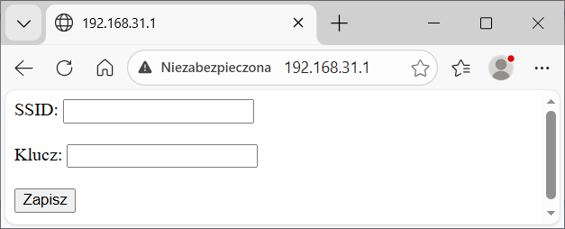
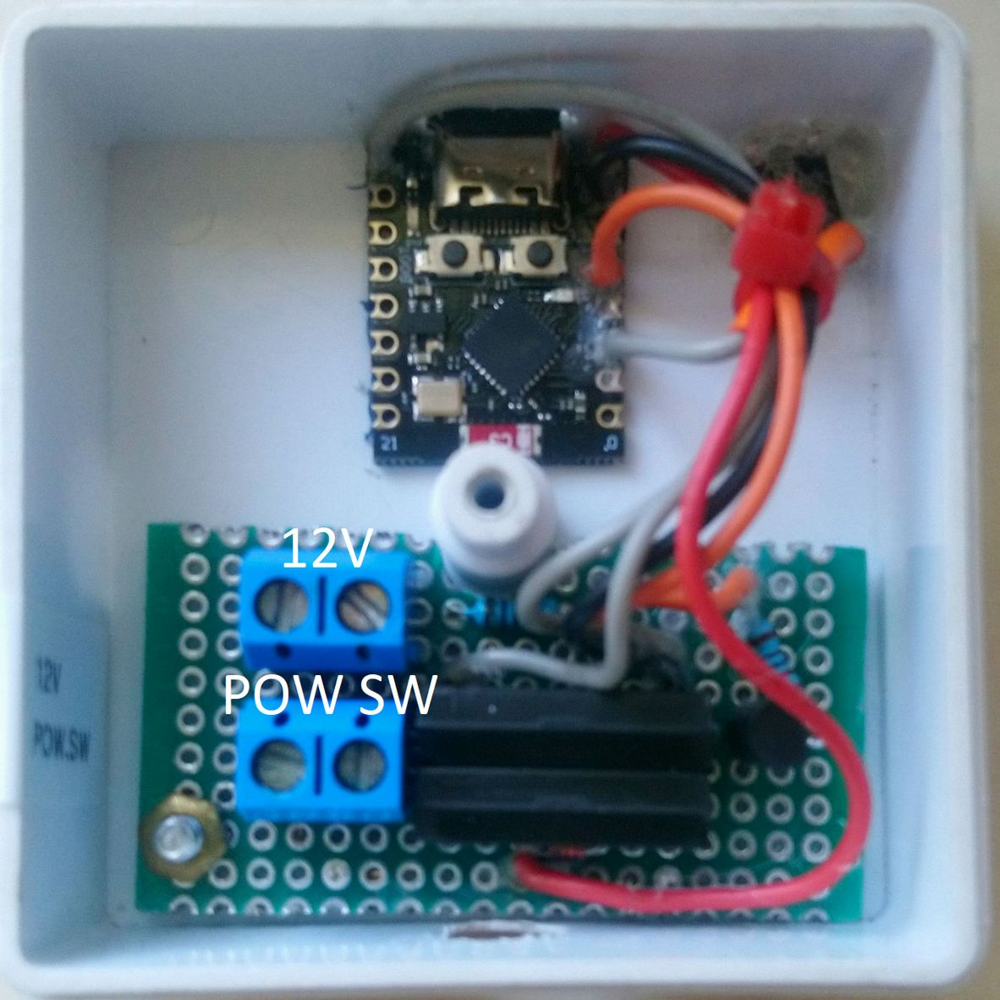

# Instrukcja obsługi zdalnego przekaźnika

## Konfigurowanie dostępu do sieci (WiFi)

1.  Naciśnij i przytrzymaj czarny przycisk na spodzie obudowy, a
    następnie podłącz zasilanie. Po podłączeniu zasilania zwolnij
    przycisk.
2.  Połącz się z siecią Wi-Fi o nazwie „KWIATKI". Klucz do sieci:
    „12345678".
3.  W pasku adresu przeglądarki internetowej wpisz adres 192.168.31.1
    i wypełnij formularz, wpisując dane sieci, z którą będzie się łączył
    przekaźnik.
    

5.  Odłącz i ponownie podłączając przewód zasilający.

## Obsługa zdalnego przekaźnika

1.  W pasku adresu przeglądarki internetowej wpisz adres
    <http://gcygan.webd.pl/kwiatki/panel.html>

2.  Wybrana akcja zostanie zrealizowana po czasie nie dłuższym niż *10
    s*, o ile zdalny przekaźnik jest połączony z siecią.

3.  Po wybraniu akcji „**Załącz**", jeżeli na wejściu *12V* nie ma
    napięcia, przekaźnik zwiera styki *POW SW* na czas *1 s*.

4.  Po wybraniu „**Wyłącz**" także zwierane są styki *POW SW* na czas *1
    s*, ale tylko w przypadku występowania napięcia na wejściu *12V*.

5.  Akcja „**Zresetuj**" powoduje zwarcie styków *POW SW* na czas *6 s*,
    w przypadku występowania napięcia na wejściu *12V*.

